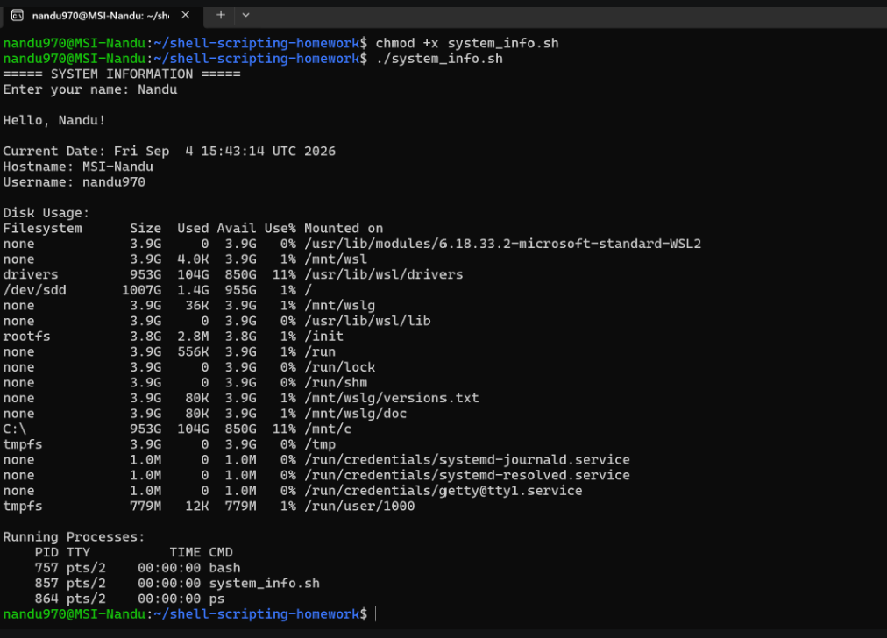
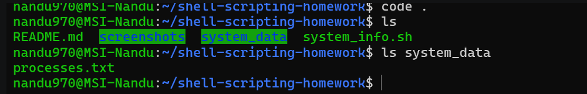
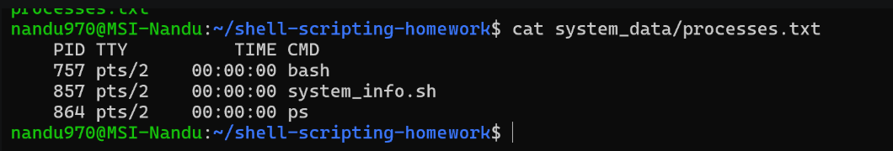

# Shell Scripting Homework - System Information Script

## Objective

The objective of this assignment is to create a shell script that displays basic system information and demonstrates the use of variables, user input, directory and file creation, and output redirection.

## Requirements

- Print the current date
- Print the hostname
- Print the username
- Print the disk usage
- Print the running processes
- Use variables to store and use data
- Take user input using read -p
- Create a directory using mkdir
- Create a file using touch
- Store running process information using > output redirection

## Commands Used

### 1. mkdir

The mkdir command is used to create a directory.

Example:

mkdir system_data

In this project, mkdir is used to create the system_data directory.

### 2. touch

The touch command is used to create a file.

Example:

touch system_data/processes.txt

In this project, touch is used to create the processes.txt file.

### 3. echo

The echo command is used to display text and variable values in the terminal.

Example:

echo "Hello, $student_name!"

### 4. df

The df command is used to display disk space usage.

Example:

df -h

The -h option displays the disk usage in a human-readable format.

### 5. ps

The ps command is used to display information about running processes.

Example:

ps

### 6. read -p

The read -p command is used to take input from the user.

Example:

read -p "Enter your name: " student_name

The entered name is stored in the student_name variable.

### 7. Variables

Variables are used to store information that can be used later in the script.

Examples:

current_date=$(date)
host_name=$(hostname)
user_name=$(whoami)
disk_usage=$(df -h)

These variables store the output of the corresponding commands.

### 8. Output Redirection

The > symbol is used to redirect command output into a file.

Example:

ps > system_data/processes.txt

This stores the output of the ps command inside processes.txt.

## Script Explanation

The script first asks the user to enter their name using read -p.

It then creates a directory named system_data using mkdir and creates a file named processes.txt using touch.

The script stores the current date, hostname, username, and disk usage in variables.

The ps command is used to get information about running processes. Its output is redirected into processes.txt using the > operator.

Finally, the script displays the collected system information and the running process information.

## Shell Script

The main script is stored in system_info.sh.

#!/bin/bash

echo "===== SYSTEM INFORMATION ====="

read -p "Enter your name: " student_name

mkdir -p system_data
touch system_data/processes.txt

current_date=$(date)
host_name=$(hostname)
user_name=$(whoami)
disk_usage=$(df -h)

ps > system_data/processes.txt

echo
echo "Hello, $student_name!"
echo
echo "Current Date: $current_date"
echo "Hostname: $host_name"
echo "Username: $user_name"
echo
echo "Disk Usage:"
echo "$disk_usage"
echo
echo "Running Processes:"
cat system_data/processes.txt

## Command Output

The script was executed using:

./system_info.sh

The user entered the name:

Nandu

The script successfully displayed the current date, hostname, username, disk usage, and running processes.

## Screenshots

### Screenshot 1 - Script Execution

This screenshot shows the execution of ./system_info.sh, the user input, current date, hostname, username, disk usage, and running processes.

### Screenshot 2 - Directory and File Creation

The following commands were used to verify the directory and file:

ls
ls system_data

This screenshot shows the system_data directory and the processes.txt file created by the script.

### Screenshot 3 - Process File

The process information stored in the file was checked using:

cat system_data/processes.txt

This screenshot shows the running process information stored inside processes.txt using output redirection.

## Project Structure

shell-scripting-homework/
├── system_info.sh
├── README.md
├── system_data/
│   └── processes.txt
└── screenshots/
    ├── 01-script-output.png
    ├── 02-files-created.png
    └── 03-process-file.png

## How to Run

Open the terminal in the project directory.

Make the script executable:

chmod +x system_info.sh

Run the script:

./system_info.sh

Enter your name when prompted.

## Conclusion

Through this assignment, I practiced basic shell scripting and Linux commands. I learned how to use variables, take user input using read -p, create directories and files using mkdir and touch, display system information using date, hostname, df, and ps, and redirect command output into a file using >.