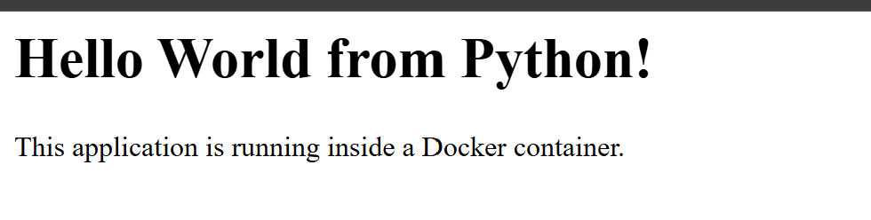
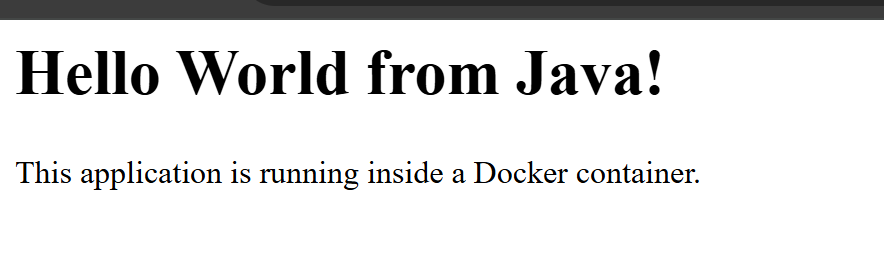
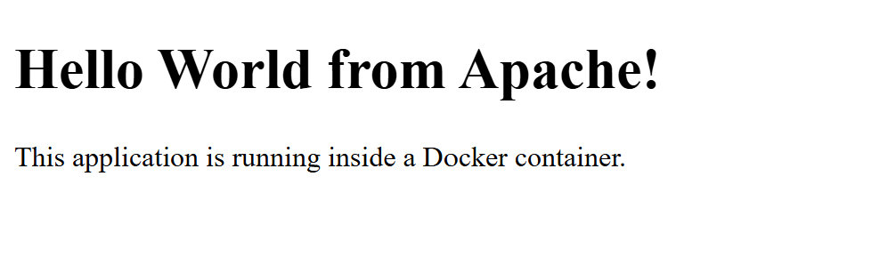
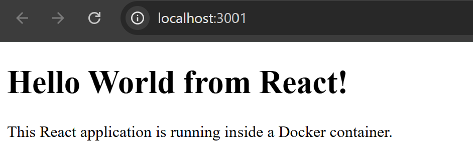
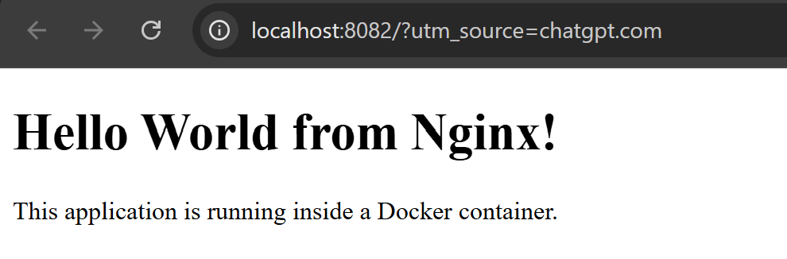

# Docker Homework — Hello World Applications

## Objective

The objective of this homework is to create and run simple Hello World web applications using Docker.

The applications created are:

- Node.js
- Python
- Java
- Apache Web Server
- React
- Nginx

Each application has its own folder and Dockerfile. The Docker images were built and the containers were run successfully. Each application was also verified through a web browser.

---

## 1. Node.js Application

A simple Node.js HTTP server was created and containerized using Docker.

- Application folder: `nodejs-app`
- Docker image: `nodejs-hello-world`
- Port: `3000`
- Dockerfile: `nodejs-app/Dockerfile`

The application displays "Hello World from Node.js!" in the browser.

### Screenshot


---

## 2. Python Application

A simple Python HTTP server was created and containerized using Docker.

- Application folder: `python-app`
- Docker image: `python-hello-world`
- Port: `5000`
- Dockerfile: `python-app/Dockerfile`

The application displays "Hello World from Python!" in the browser.

### Screenshot



---

## 3. Java Application

A simple Java HTTP server was created and containerized using Docker.

- Application folder: `java-app`
- Docker image: `java-hello-world`
- Port: `8080`
- Dockerfile: `java-app/Dockerfile`

The application displays "Hello World from Java!" in the browser.

### Screenshot



---

## 4. Apache Web Server

A simple HTML page was served using the Apache HTTP Server Docker image.

- Application folder: `Apache-app`
- Docker image: `apache-hello-world`
- Port: `8081`
- Dockerfile: `Apache-app/Dockerfile`

The webpage displays "Hello World from Apache!".

### Screenshot



---

## 5. React Application

A simple React-based Hello World application was created and containerized using Docker.

- Application folder: `React-app`
- Docker image: `react-hello-world`
- Port: `3001`
- Dockerfile: `React-app/Dockerfile`

The application displays "Hello World from React!" in the browser.

### Screenshot


---

## 6. Nginx Web Server

A simple HTML page was served using the Nginx Docker image.

- Application folder: `nginx-app`
- Docker image: `nginx-hello-world`
- Port: `8082`
- Dockerfile: `nginx-app/Dockerfile`

The webpage displays "Hello World from Nginx!".

### Screenshot


---

# Project Structure

```text
docker-homework/
├── README.md
├── nodejs-app/
│   ├── server.js
│   └── Dockerfile
├── python-app/
│   ├── app.py
│   └── Dockerfile
├── java-app/
│   ├── Main.java
│   └── Dockerfile
├── Apache-app/
│   ├── index.html
│   └── Dockerfile
├── React-app/
│   ├── package.json
│   ├── server.js
│   ├── index.html
│   └── Dockerfile
└── nginx-app/
    ├── index.html
    └── Dockerfile