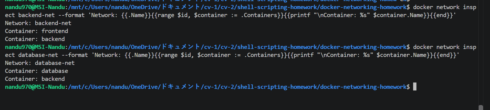
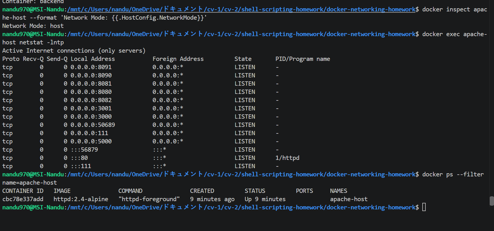
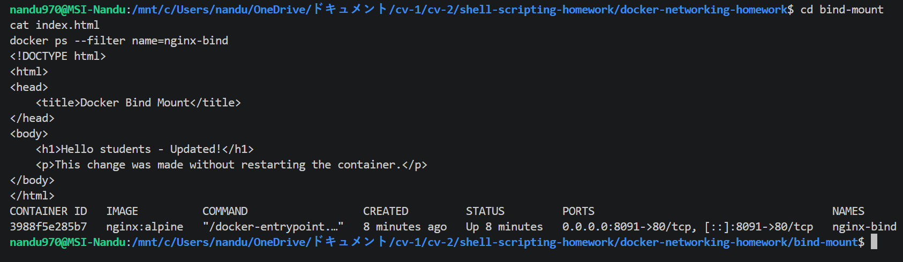
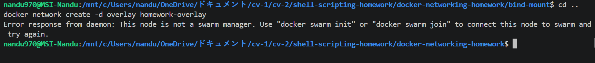

# Docker Networking & Volume Homework

# Task 1: Docker Container Networking

## Objective

The objective of this task was to create three Docker containers and connect them using different Docker networks.

The containers created were:

- Frontend
- Backend
- Database

The frontend uses an Nginx image, the backend uses Alpine Linux, and the database uses MySQL.

## Docker Networks

Three Docker bridge networks were created:

- `frontend-net`
- `backend-net`
- `database-net`

The backend container was connected to two networks:

- `backend-net`
- `database-net`

The frontend was connected to:

- `frontend-net`
- `backend-net`

The database was connected to:

- `database-net`

## Container Connectivity

The following connectivity tests were performed:

- Frontend → Backend
- Backend → Database

Both connectivity tests were successful with 0% packet loss.

The `docker network inspect` command was also used to verify the containers connected to each network.

### Screenshot

---

# Task 2: Host Network

## Objective

The objective of this task was to run an Apache web server using Docker host networking.

An Apache container was created using the `httpd:2.4-alpine` image with the host network:

`docker run -d --network host --name apache-host httpd:2.4-alpine`

The container was verified using Docker commands.

The Apache process was confirmed to be listening on port `80`.

The command below was used to verify the network mode:

`docker inspect apache-host --format '{{.HostConfig.NetworkMode}}'`

The output was:

`host`

The Apache listening port was verified using `netstat`.

### Screenshot

---

# Task 3: Bind Mount

## Objective

The objective of this task was to use a bind mount to connect a local folder to an Nginx container.

A local `index.html` file was created with the following content:

**Hello students**

The folder was mounted into an Nginx container using a bind mount.

The application was accessed through:

`http://localhost:8091`

The webpage initially displayed:

**Hello students**

The local `index.html` file was then modified while the container was still running.

After refreshing the browser, the updated content was displayed without restarting the container.

This demonstrated that changes made to the local file are immediately reflected inside the container through the bind mount.

### Screenshot

---

# Task 4: Overlay Network

## Objective

The objective of this task was to understand Docker overlay networks and their use cases.

An attempt was made to create an overlay network using:

`docker network create -d overlay homework-overlay`

Docker reported that the current node was not a Swarm manager.

Overlay networks are designed to allow containers running on different Docker hosts to communicate over the same logical network.

They are commonly used with Docker Swarm.

## Understanding

A bridge network is generally used for containers communicating on the same Docker host.

An overlay network can span multiple Docker hosts and is useful for distributed container applications.

Docker Swarm provides the orchestration and networking infrastructure required to use overlay networks across multiple nodes.

### Command Output

---

# Docker Commands Practiced

- `docker network create`
- `docker network ls`
- `docker network inspect`
- `docker network connect`
- `docker run`
- `docker ps`
- `docker exec`
- `docker inspect`
- `docker pull`
- `docker network create -d overlay`

---

# What I Learned

Through this homework, I learned how Docker networking allows containers to communicate with each other.

I learned how multiple bridge networks can be created and how a container can be connected to more than one network.

I also learned how container names can be used for communication between containers on the same Docker network.

The bind mount exercise helped me understand how a local directory can be mounted into a container and how changes to local files can be reflected immediately.

I also learned that Docker overlay networks are designed for communication across multiple Docker hosts and are commonly used with Docker Swarm.

---

# Conclusion

This homework helped me understand Docker container networking, host networking, bind mounts, and overlay networks. I successfully created and tested container connectivity, deployed an Apache container using host networking, used a bind mount with Nginx, and researched the purpose of Docker overlay networks.