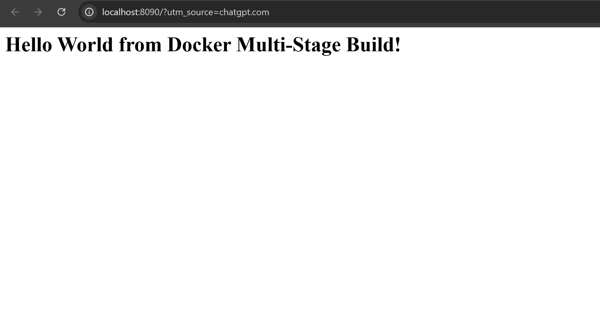
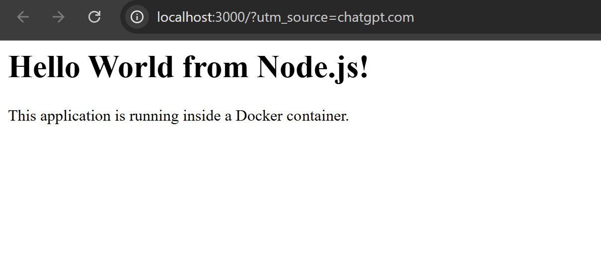
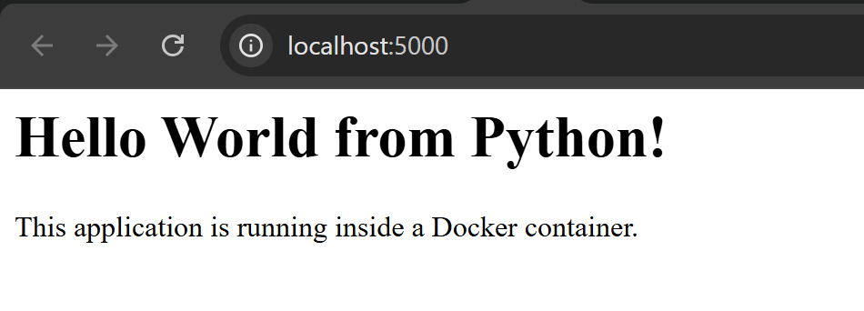
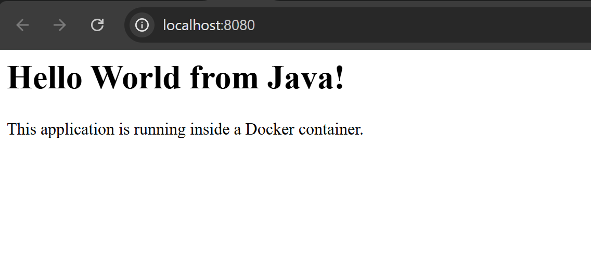

# Docker Multi-Stage Build Homework

## Student Details

- Name: Nandu
- Enrollment Number: YOUR_ENROLLMENT_NUMBER

---

# Task 1: Run Multi-Stage Dockerfile

## Objective

The objective of this task was to build and run a Node.js application using a multi-stage Dockerfile.

The application displays:

**Hello World from Docker Multi-Stage Build!**

## Multi-Stage Dockerfile

The Dockerfile uses two stages:

- Build stage: installs the application dependencies and prepares the application.
- Production stage: creates the final image and copies the required application files from the build stage.

## Docker Commands Used

- `docker build -t docker-multistage-hello .`
- `docker run -d -p 8080:3000 --name docker-multistage-app docker-multistage-hello`
- `docker ps`

The application runs on port `3000` inside the container and is accessed through port `8080` on the host.

## Verification

The application was successfully opened in a web browser using:

`http://localhost:8090`

The browser displayed:

**Hello World from Docker Multi-Stage Build!**

### Screenshot

---

# Task 2: Documentation

## Objective

The purpose of this task was to document the Docker multi-stage build and provide evidence that the application was running successfully.

### Student Information

- Name: Nandu
- Enrollment Number: YOUR_ENROLLMENT_NUMBER

### Application Running

The Node.js application was successfully deployed using the multi-stage Dockerfile and accessed through port `8080`.

### Running Container

The `docker ps` command was used to verify that the container was running and that port `8080` was mapped correctly.

---

# Task 3: Docker Application Deployment

## Objective

The objective of this task was to deploy at least three different types of applications using Docker.

The applications selected were:

1. Node.js
2. Python
3. Java

## Node.js Application

A Node.js application was containerized using Docker and successfully deployed.

- Application: Node.js
- Docker image: `nodejs-hello-world`
- Port: `3000`

### Screenshot

---

## Python Application

A Python application was containerized using Docker and successfully deployed.

- Application: Python
- Docker image: `python-hello-world`
- Port: `5000`

### Screenshot

---

## Java Application

A Java application was containerized using Docker and successfully deployed.

- Application: Java
- Docker image: `java-hello-world`
- Port: `8080`

### Screenshot

---

# Docker Commands Practiced

The following Docker commands were practiced during this homework:

- `docker build`
- `docker run`
- `docker ps`
- `docker images`
- Port mapping using `-p`

---

# What I Learned

Through these tasks, I learned how to:

- Create Dockerfiles for applications.
- Build Docker images.
- Use multi-stage Docker builds.
- Run applications inside Docker containers.
- Map container ports to host ports.
- Verify running containers using `docker ps`.
- Deploy different types of applications using Docker.
- Access containerized applications through a web browser.

---

# Conclusion

This homework helped me understand the basic Docker application deployment workflow and the use of multi-stage Dockerfiles. I successfully built and ran a Node.js application using a multi-stage build and also deployed Node.js, Python, and Java applications using Docker.