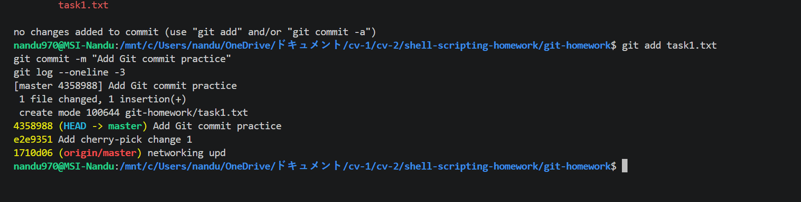
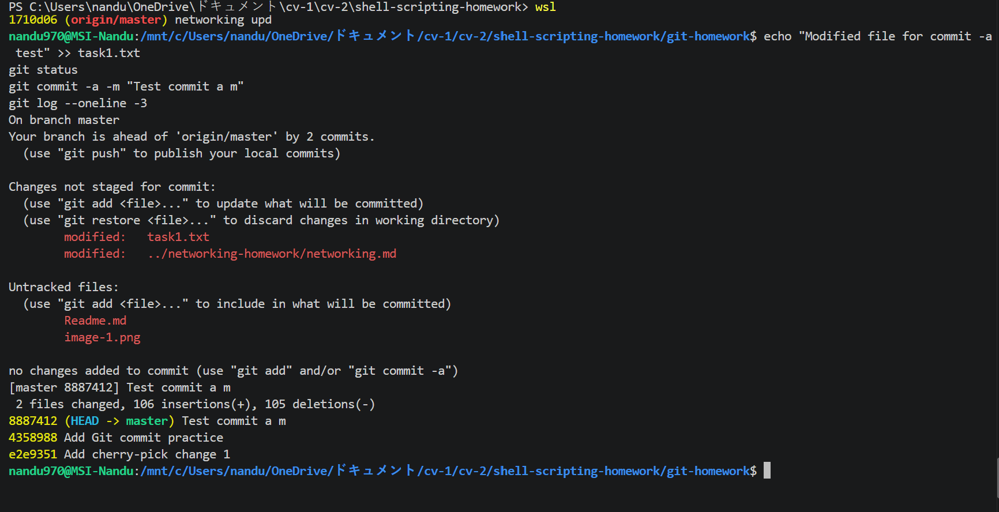
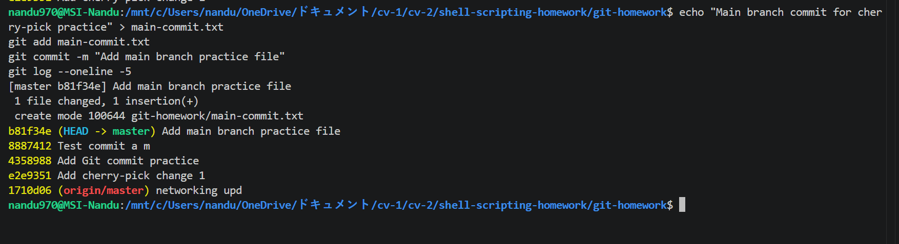
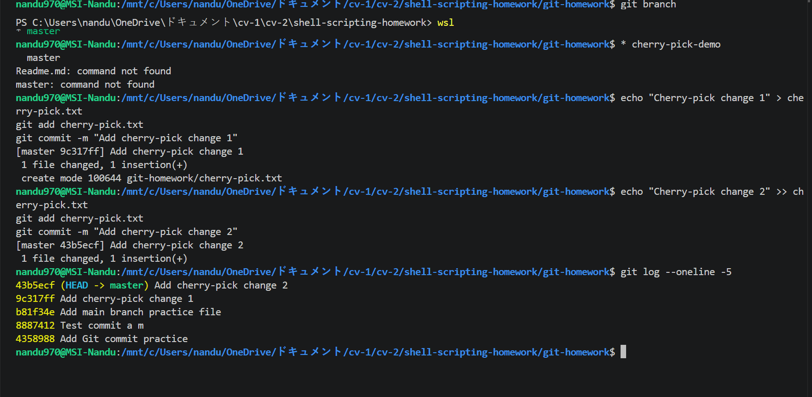

# Git Homework

## Task 1: git commit -a -m

### Objective

To practice `git commit -m` and `git commit -a -m` and understand the difference between them.

### git commit -m

The `git commit -m` command creates a commit using changes that have already been staged with `git add`.

### git commit -a -m

The `git commit -a -m` command automatically stages changes to already tracked files and commits them. It does not include new untracked files.

### Screenshot 1

### What I Understood

`git commit -m` requires changes to be staged manually using `git add`.

`git commit -a -m` can automatically stage modified tracked files, so `git add` is not required for those files.

---

# Task 2: Git Cherry-Pick

## Creating Commits in the Main Branch

I created multiple commits in the main branch and used `git log --oneline` to view the commit history.

### Screenshot 2

## Creating a New Branch

I created a new branch and made multiple commits in the new branch.

### Screenshot 3

## Identifying a Commit

I used `git log --oneline` to identify the specific commit that I wanted to cherry-pick.

## Cherry-Picking a Specific Commit

I switched back to the main branch and used `git cherry-pick` with the selected commit ID.

## Verification

After cherry-picking, I used `git log --oneline` and checked the files to verify that the selected change was available in the main branch.

### Screenshot 4

---

# Commands Practiced

- `git status`
- `git add`
- `git commit -m`
- `git commit -a -m`
- `git log --oneline`
- `git branch`
- `git checkout`
- `git cherry-pick`

# Conclusion

Through this homework, I learned how to create commits, compare `git commit -m` with `git commit -a -m`, create and switch branches, identify specific commits, and use `git cherry-pick` to apply one specific commit from another branch.