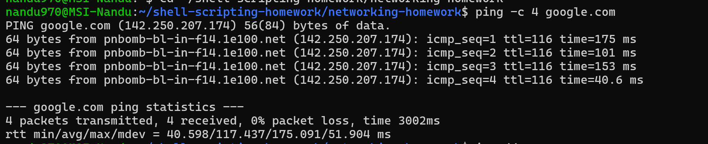
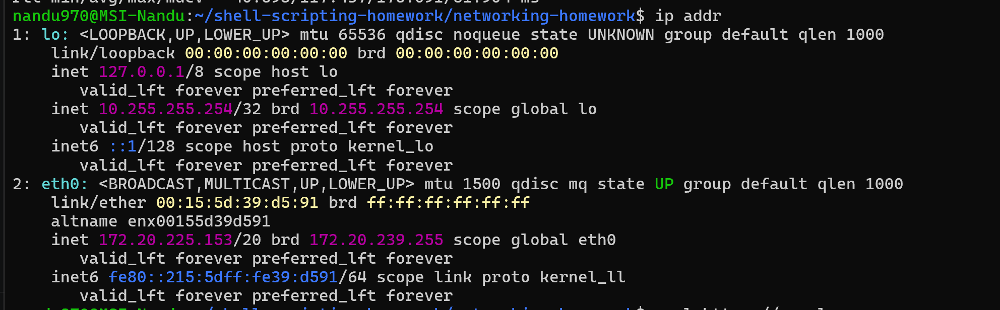
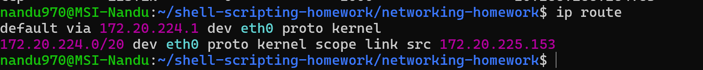
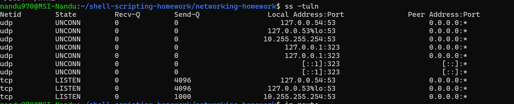
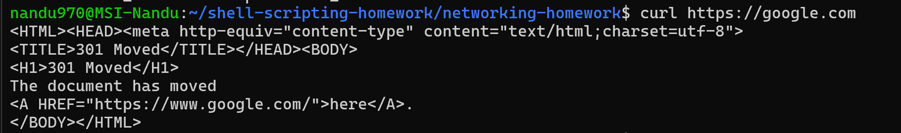

# Networking Homework

## Objective

The objective of this task is to practice basic Linux networking commands and understand how networking works in Ubuntu.

## Commands Used

1. `ping`
2. `ip addr`
3. `ip route`
4. `ss -tuln`
5. `curl`

---

## 1. ping

### Command

ping -c 4 google.com

### What I Understood

The `ping` command is used to check whether a computer can communicate with another device or server over a network. It sends packets and shows whether replies are received.

---

## 2. ip addr

### Command

ip addr

### What I Understood

The `ip addr` command displays information about network interfaces and their IP addresses. It helps identify the IP address assigned to the system.

---

## 3. ip route

### Command

ip route

### What I Understood

The `ip route` command displays the routing table. It shows how network traffic is routed and which gateway is used to reach other networks.

### Output / Screenshot

---

## 4. ss -tuln

### Command

ss -tuln

### What I Understood

The `ss -tuln` command displays listening TCP and UDP ports on the system. It helps to understand which network services are currently listening for connections.

### Output / Screenshot

---

## 5. curl

### Command

curl https://google.com

### What I Understood

The `curl` command is used to communicate with web servers and retrieve data from URLs. It can also be used to test whether an HTTP or HTTPS connection is working.

---

## Project Structure

networking-homework/
├── networking.md
└── screenshots/
    ├── 01-ping.png
    ├── 02-ip-addr.png
    ├── 03-ip-route.png
    ├── 04-ss-tuln.png
    └── 05-curl.png

## Conclusion

Through this task, I practiced basic Linux networking commands and understood how to check network connectivity, view IP addresses, check routing information, view listening ports, and test communication with a web server.